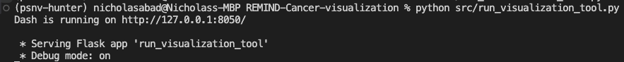
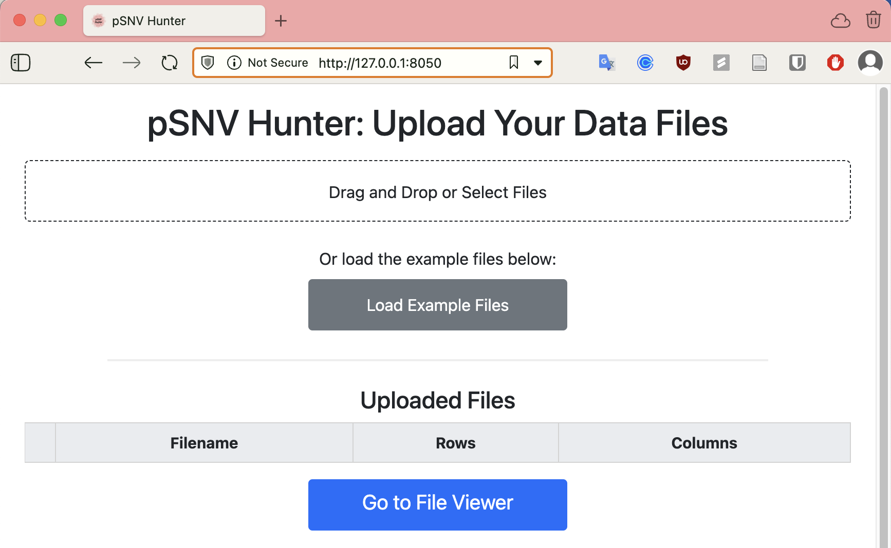
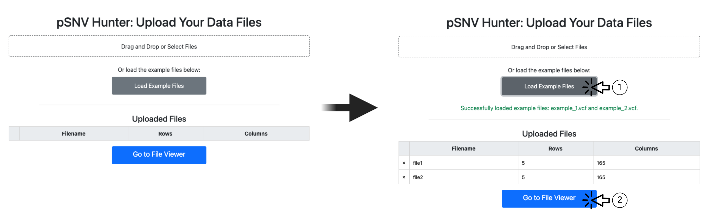
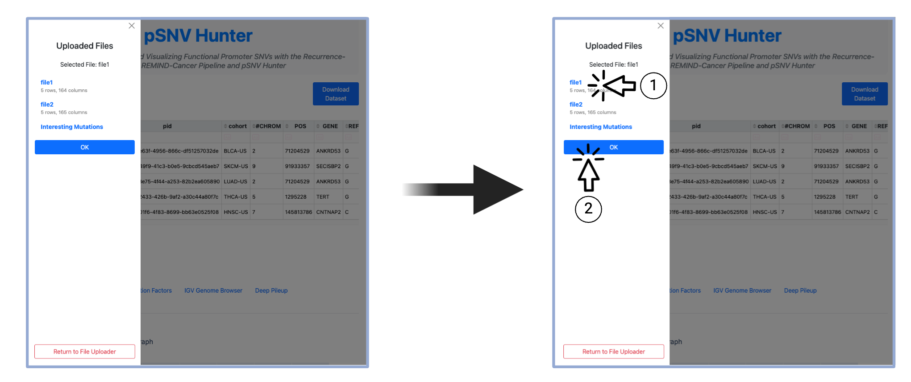
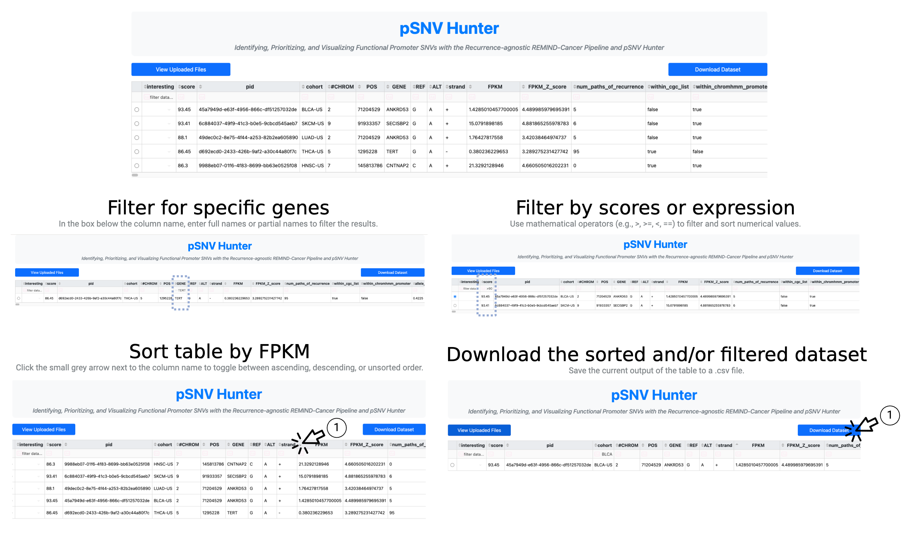
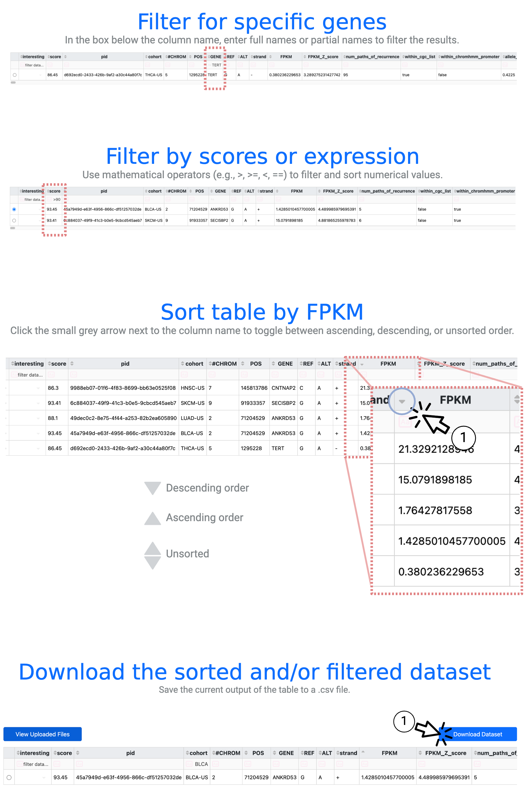
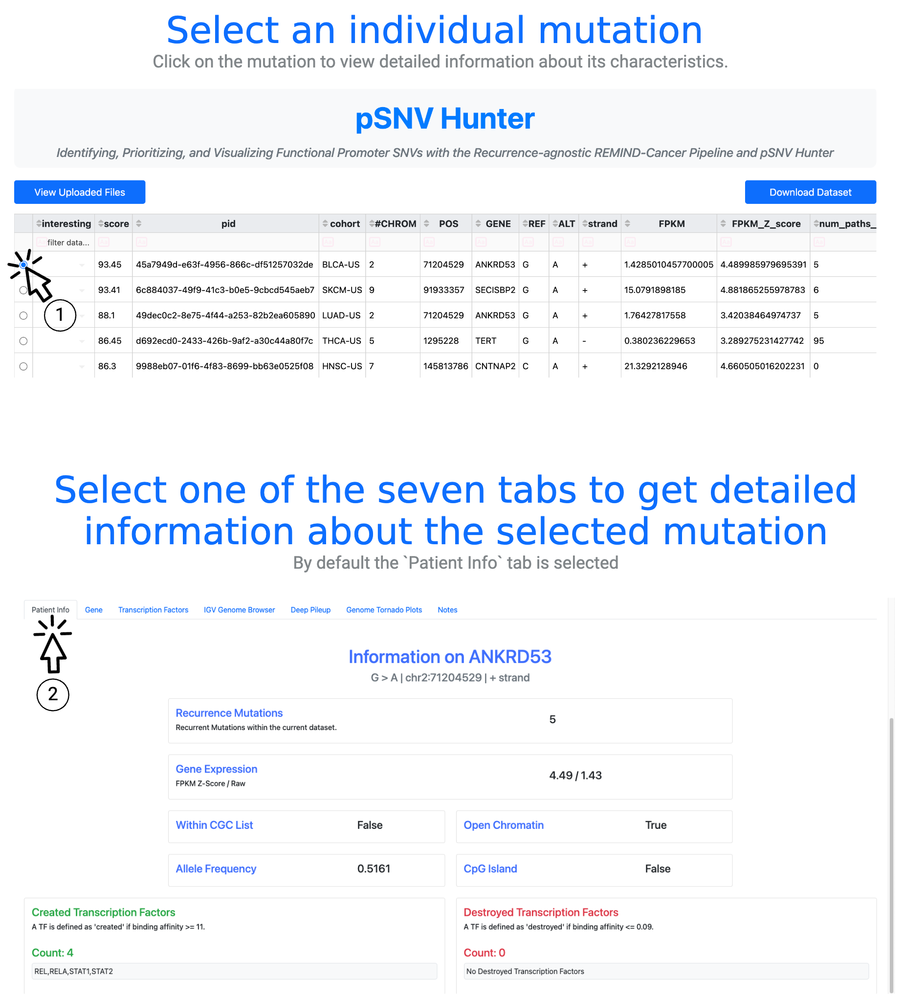

# pSNV Hunter

Promoter SNV (pSNV) Hunter is a comprehensive data aggregation and visualization tool particularly used to identify functional promoter SNVs within the REMIND-Cancer project.

Currently, pSNV Hunter is within a closed beta form. However, if you'd like access, please contact Nicholas Abad at nicholas.a.abad@gmail.com.

## Run pSNV Hunter

1. Clone the repository and the submodule
   ```
   git clone --recurse-submodules -j8 https://github.com/nicholas-abad/pSNV-hunter.git
   ```
2. Open the terminal and change directories into `REMIND-Cancer-visualization `
   ```
   cd pSNV-hunter/REMIND-Cancer-visualization
   ```
3. Download the necessary Python packages using .
   ```
   pip install -r requirements.txt
   ```
4. Run pSNV Hunter
   ```
   python src/run_visualization_tool.py
   ```
5. The prior Python command should output the following:

<center>

</center>

By default, pSNV Hunter will be running locally at the location listed, which by default and in this case is [http://127.0.0.1:8050](http://127.0.0.1:8050) or [localhost:8050](localhost:8050).

6. You can either click the link if it’s clickable or open a browser and manually type the full link into the address bar. An example can be seen below:

<center>

</center>

7. When you're done using **_pSNV Hunter_**, make sure to stop it from running in the command line by pressing `Ctrl + c`.

## Tutorial

This section will outline the main features of pSNV-Hunter and how to use it. As a reminder, the main goal of **_pSNV Hunter_** is to individually analyze mutations, particularly SNVs within the promoter that have passed the REMIND-Cancer pipeline.

#### Loading in two example datasets

You can load two example datasets included in the repository by clicking the `Load Example Files` button [Step 1]. Conversely, if you wanted to input your own .vcf files, you can load them by clicking on the `Drop and Drag or Select Files` button above it.

Once files are loaded in, basic details such as the filename, the number of rows and the number of columns can be seen. To proceed, click on the `Go to File Viewer` button [Step 2].



#### Choose the dataset to analyze

A window will appear on the left, displaying the uploaded file names along with `Interesting Mutations`. To switch between files, simply click on the desired file [Step 1] and then press `Okay` [Step 2]. The selected file name will be displayed above the file list.

If you need to go back to the file uploader page, click the red `Return to File Uploader` button at the bottom left.



#### Filter, sort, and download the table

The file you selected will now be displayed in a table-like format as seen below. Conversely, to switch between the uploaded files click on the `View Uploaded Files` button.



Using this table, you can filter, sort, and download the dataset. The example below demonstrates how to: (1) filter by a specific string column (e.g., GENE), (2) filter a numerical column (e.g., score) using mathematical expressions, (3) sort the table by a numerical column, and (4) download the filtered dataset.

<center>

</center>
<br>

#### Selecting a mutation

To view detailed information about an individual, sample-specific mutation, click the blue button to the left of the mutation of interest within the table [Step 1].

After selecting a mutation, you can explore various tabs [Step 2] to view information and graphs related to the chosen mutation.

<center>

</center>

In short, the seven different selectable tabs can be summarized here:

- **`Patient Info`**: Key details about the mutation, including the number of recurrent mutations (i.e., occurrences of the mutation at this genomic location in other samples), raw and normalized expression values, whether it is classified as a known cancer gene (i.e., listed in the Cancer Gene Census), its presence in a region of open chromatin, allele frequency, CpG island status, and any transcription factor binding sites (TFBSs) that are created or disrupted.
- **`Gene`**:
- **`Transcription Factors`**:
- **`IGV Genome Browser`**:
- **`Deep Pileup`**:
- **`Notes`**:

## Additional Information:

- All images displayed, which are within this repository's `assets` folder, were created using a premium [BioRender.com](https://www.Biorender.com) account and are licensed under CC-BY (Creative Commons). For proof of individual image licenses, please contact Nicholas Abad at `nicholas.a.abad@gmail.com`.
